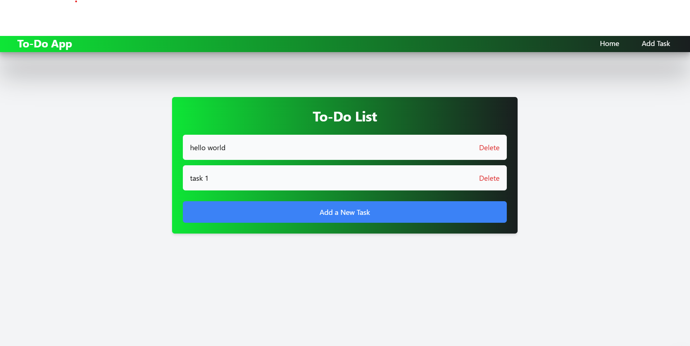

# To-Do App

A simple To-Do application built with Flask, HTML, and styled using Tailwind CSS.

## Features
- Add, edit, and delete tasks.
- Simple and user-friendly interface.

## Prerequisites
Ensure you have the following installed:
- Python (>= 3.7)
- Flask (`pip install flask`)
- Tailwind CSS (via CDN)

## Installation and Setup

1. **Clone the Repository:**
   ```bash
   git clone https://github.com/your-username/todo-app.git
   cd todo-app
   ```

2. **Install Dependencies:**
   ```bash
   pip install -r requirements.txt
   ```

3. **Run the Application:**
   ```bash
   python app.py
   ```

4. **Access the App:**
   Open your browser and navigate to `http://127.0.0.1:5000`.

## Tailwind CSS Integration
The project uses Tailwind CSS through a CDN. Make sure the following line is included in your HTML `<head>`:

```html
<link href="https://cdn.jsdelivr.net/npm/tailwindcss@3.3.3/dist/tailwind.min.css" rel="stylesheet">
```

## Screenshot



---